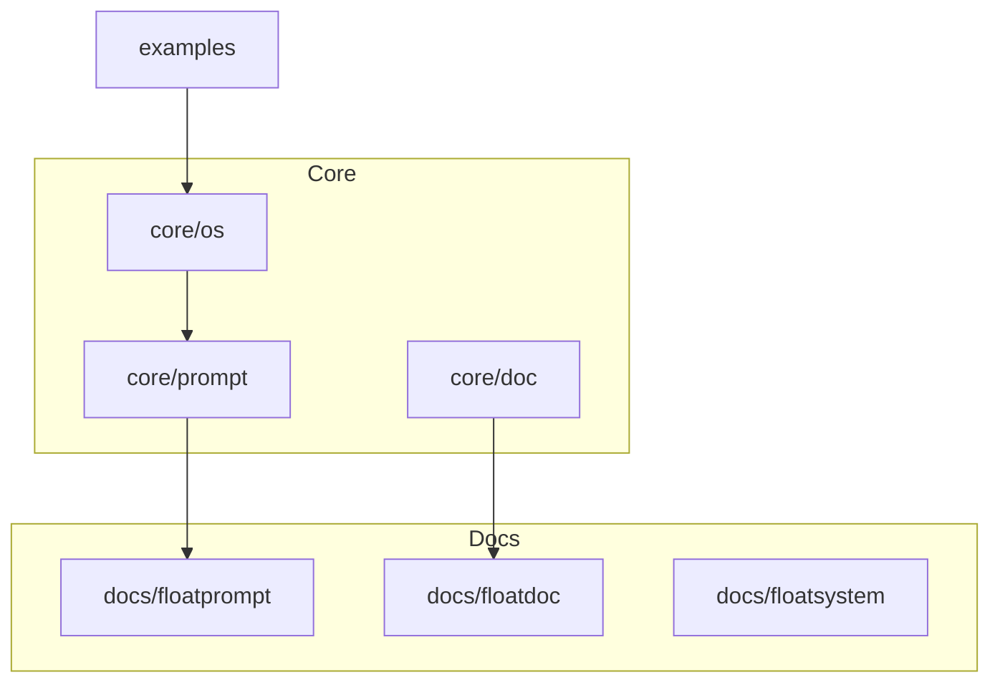

# FloatLinking Specification

Add bidirectional linking, tags, and connection mapping to FloatSystem.

---

## Philosophy

**The problem:** FloatSystem files are islands. Navigation exists via `_float.md` tables, but inline connections between files are implicit, not explicit.

**The solution:** Adopt Obsidian-compatible conventions that work in any markdown editor but unlock full power in graph-aware tools.

**Principle:** Text files are the universal format. Conventions should enhance, not require, specific tools.

---

## Features

### 1. Wikilinks

**Syntax:** `[[path/to/file]]` or `[[path/to/file|display text]]`

**Convention:**
- Use relative paths from repo root
- Omit `.md` extension
- Use `|` for display text when filename isn't clear

**Examples:**

```markdown
See [[docs/floatprompt]] for the format specification.
The [[core/prompt|basic template]] is the starting point.
Related: [[core/os]], [[core/doc]]
```

**AI behavior:**
- When referencing files, use wikilink syntax
- Validate links exist (flag broken links during sync)
- Suggest links when content mentions other files

---

### 2. Tags

**Syntax:** YAML frontmatter `tags` field

**Convention:**
- Use lowercase, hyphenated tags
- Keep tags flat (no hierarchy in tag names)
- 3-5 tags per document max

**Examples:**

```yaml
---
title: FloatPrompt Format
type: specification
status: current
tags: [format, core, template]
---
```

```yaml
---
title: AI Portfolio Coach
type: example
status: current
tags: [example, coach, multi-phase]
---
```

**Standard tags:**

| Tag | Usage |
|-----|-------|
| `core` | Essential system files |
| `format` | File format specifications |
| `example` | Real-world floatprompt examples |
| `template` | Templates for creating new files |
| `philosophy` | Background thinking, manifesto |
| `methodology` | MDS method, processes |
| `archived` | Historical, no longer active |

**AI behavior:**
- Suggest tags based on content analysis
- Maintain tag consistency across similar files
- Flag orphan tags (used only once)

---

### 3. Backlinks

**Location:** `## Backlinks` section in `_float.md` files

**Format:**

```markdown
## Backlinks

Files that reference this folder:

| File | Context |
|------|---------|
| [[_float/index]] | Root navigation mentions this folder |
| [[docs/floatsystem]] | Architecture overview references examples |
```

**AI behavior:**
- Scan all files for wikilinks
- Update backlinks section during `/float sync`
- Group by folder when many backlinks exist

**Example in `examples/_float.md`:**

```markdown
## Backlinks

| File | Context |
|------|---------|
| [[_float/index]] | "Real-world FloatPrompt tools" |
| [[docs/use]] | "See examples/ for working tools" |
| [[README]] | Examples table in documentation |
```

---

### 4. Connection Graph

**Location:** Optional `## Graph` section in `_float/index.md`

**Format:** Mermaid diagram

```markdown
## Connection Graph


```

**AI behavior:**
- Generate from wikilink analysis
- Update during major structural changes
- Keep diagram focused (top-level connections only)

---

## Integration with FloatSystem

### Updated `_float.md` Template

```markdown
---
title: {Folder Name}
type: float
status: current
tags: [category]
ai_updated: YYYY-MM-DD
---

# {Folder Name}

{Description}

## Contents

| File | Purpose |
|------|---------|
| **[[filename]]** | Description |

## Subfolders

| Folder | Purpose |
|--------|---------|
| **[[subfolder/]]** | Description |

## Backlinks

| File | Context |
|------|---------|
| [[referencing-file]] | How it references this folder |

---

<!-- AI: Update wikilinks and backlinks when files change. -->
```

### Updated FloatDoc Frontmatter

```yaml
---
title:
type:
status:
created:
tags: []              # NEW

human_author:
human_intent:
human_context:

ai_model:
ai_updated:
ai_notes:
---
```

### Updated Boot Sequence

Add to step 3 of `_float/system.md`:

```
3. Traverse _float/index.md and ALL _float.md files. 
   - Verify Contents tables match parent folder contents
   - Verify wikilinks resolve to existing files
   - Flag broken links
```

---

## `/float sync` Updates

### Link Validation

```
Checking links...

✓ [[docs/floatprompt]] — OK
✓ [[core/prompt]] — OK
✗ [[docs/old-file]] — File not found
✗ [[examples/deleted-example]] — File not found

Found 2 broken links.

Proposed fixes:
  - Remove [[docs/old-file]] from docs/_float.md
  - Remove [[examples/deleted-example]] from README.md

Apply changes? (y/n):
```

### Backlink Generation

```
Updating backlinks...

  → examples/_float.md: 3 backlinks found
  → docs/_float.md: 5 backlinks found
  → core/_float.md: 2 backlinks found

Backlinks updated in 3 files.
```

---

## Obsidian Compatibility

FloatSystem with FloatLinking works in Obsidian out of the box:

| Feature | Obsidian | Plain Markdown |
|---------|----------|----------------|
| Wikilinks | Clickable navigation | Visible as `[[path]]` |
| Backlinks | Automatic panel | Manual section in `_float.md` |
| Tags | Searchable, filterable | YAML frontmatter |
| Graph | Interactive visualization | Mermaid diagrams |
| Canvas | Spatial arrangement | Not supported |

**Not required:** Obsidian is optional. All features work as plain text.

---

## Implementation Order

1. **Phase 1: Conventions** (immediate)
   - Add linking convention to `_float/system.md`
   - Add `tags` field to FloatDoc spec
   - Update `_float.md` template

2. **Phase 2: AI Behavior** (with `/float sync` updates)
   - Wikilink validation during sync
   - Backlink generation
   - Tag suggestions

3. **Phase 3: Visualization** (optional)
   - Mermaid graph generation
   - Tag clustering analysis

---

## Examples

### Before (current)

```markdown
## Contents

| File | Purpose |
|------|---------|
| **floatprompt.md** | Format specification |
| **floatdoc.md** | Document context format |
```

### After (with FloatLinking)

```markdown
## Contents

| File | Purpose |
|------|---------|
| **[[docs/floatprompt]]** | Format specification |
| **[[docs/floatdoc]]** | Document context format |

## Backlinks

| File | Context |
|------|---------|
| [[_float/index]] | Root navigation |
| [[core/prompt]] | References format spec |
```

---

## Open Questions

1. **Alias support?** — `[[floatprompt|fp]]` for abbreviations?
2. **Header links?** — `[[docs/floatprompt#Quick Start]]` for section links?
3. **Embed syntax?** — `![[file]]` for transclusion (Obsidian-specific)?
4. **Tag hierarchy?** — `#format/spec` vs flat tags?

---

## Summary

| Feature | Syntax | Location | AI Maintained |
|---------|--------|----------|---------------|
| Wikilinks | `[[path]]` | Inline in content | Validated |
| Tags | `tags: []` | YAML frontmatter | Suggested |
| Backlinks | Table | `_float.md` | Generated |
| Graph | Mermaid | `_float/index.md` | Generated |

**Text files remain the source of truth. Tools enhance, not require.**

---

© 2025 @MDS

